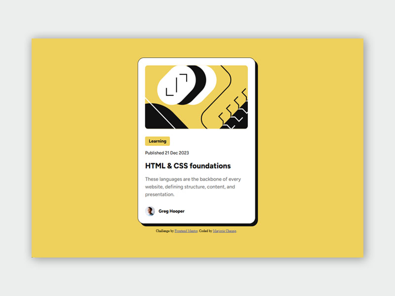
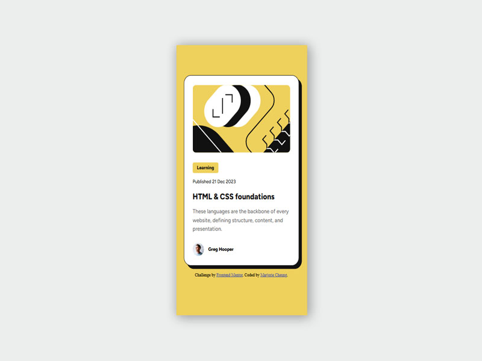

## Overview

A responsive blog preview card built using HTML & CSS. The card adjusts dynamically for both desktop and mobile screens using flexible layouts and font scaling techniques. It also uses self-hosting fonts which improves page speed.

### Screenshot

Desktop version:

Mobile version:

### Links

- Live Site URL: [click here](https://blog-preview-card-nine-mu.vercel.app/)

### How to Use

Clone the repository.

Open index.html in your browser.

Adjust the window size to see the responsive behavior in action.

### Acknowledge

Developed by Marjorie Cheung.

This is a solution to the [Blog Preview Card](https://www.frontendmentor.io/solutions/responsive-blog-preview-card-using-local-font-qrhmHfWtfs) under [Frontend Mentor](https://www.frontendmentor.io/).
