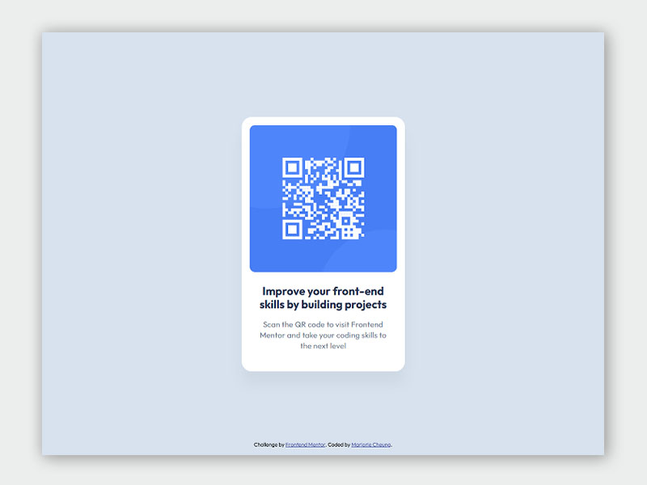

## Overview

This CSS snippet provides a clean and responsive card component boilerplate, featuring a centered layout, rounded corners, and basic typography styling. It can be easily customized for various projects.

### Screenshot

Desktop version:

Mobile version:

### Links

- Live Site URL: [click here](https://qr-code-snippet.vercel.app/)

### Acknowledge

This is a solution to the [QR code component challenge on Frontend Mentor](https://www.frontendmentor.io/challenges/qr-code-component-iux_sIO_H).
