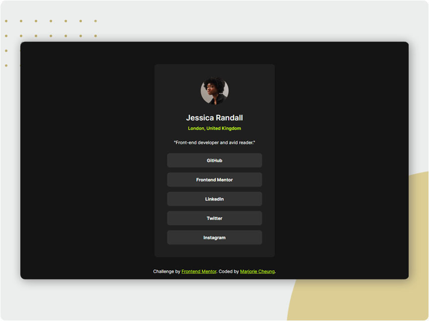
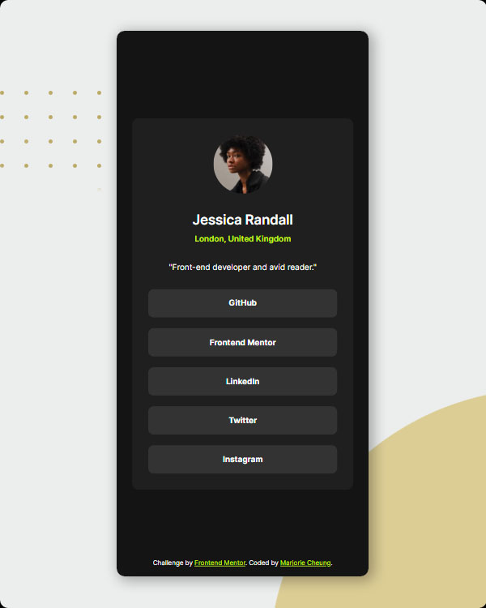

# Social Links Profile

## Overview

A responsive **Social Links Profile** card built using **HTML & CSS**. This project demonstrates a clean and modern profile design that adapts smoothly to various screen sizes—from desktops to mobile devices. The design emphasizes a circular profile photo, engaging typography, and interactive social media buttons. It leverages CSS custom properties and functions (such as `clamp()`) for responsive scaling and consistency.

### Screenshot

**Desktop version:**



**Mobile version:**



### Links

- Live Site URL: [click here](https://social-links-profile-pied-chi.vercel.app/)

## Features

- **Responsive Design:**  
  Uses modern CSS techniques like `clamp()` and responsive units (e.g., `vw`, `rem`) to ensure the layout scales smoothly on any device.

- **CSS Variables:**  
  The project splits styling into three modular CSS files:

  - **color.css:** Defines a palette of colors using custom properties.
  - **font.css:** Manages typography, including local font integration with `@font-face` and responsive font sizing.
  - **style.css:** Contains the main layout and component styles, such as the profile card, profile photo, and social link buttons.

- **Local Font Integration:**  
  The **Inter** font is integrated locally via `@font-face` for consistent and accessible typography.

- **Interactive UI:**  
  Social media buttons feature hover effects to provide visual feedback and improve the user experience.

- **Semantic & Accessible Markup:**  
  The HTML structure uses semantic tags (e.g., `<article>`, `<nav>`, `<footer>`) and ARIA attributes where applicable, ensuring enhanced accessibility and SEO.

## Built With

- **HTML5** for semantic markup.
- **CSS3** for styling, responsive design, and custom properties.
- **Local Fonts** via `@font-face` for reliable typography.

## How to Use

1. **Clone the Repository:**
   ```bash
   git clone https://github.com/your-username/social-links-profile.git
   ```

### Acknowledge

Developed by Marjorie Cheung.

This is a solution to the [Social Links Profile Challenge](https://www.frontendmentor.io/solutions/responsive-blog-preview-card-using-local-font-qrhmHfWtfs) under [Frontend Mentor](https://www.frontendmentor.io/).
